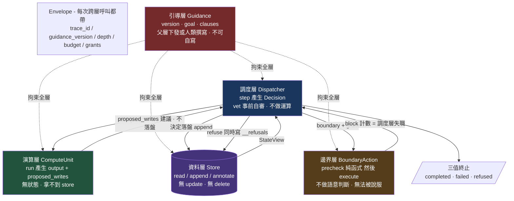
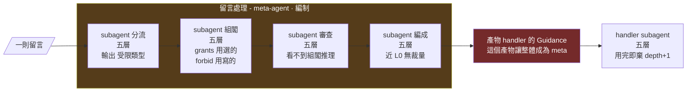
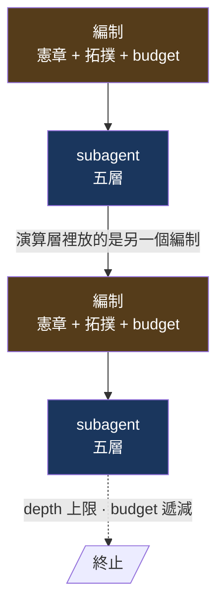
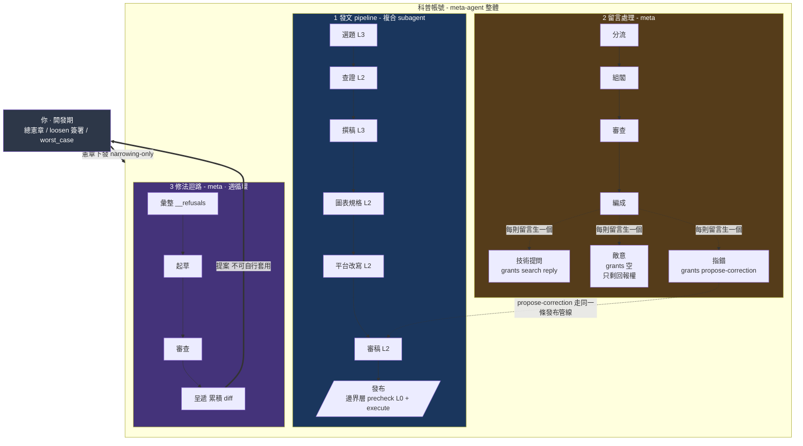

# VibeAgent 架構圖

> 狀態：**對齊確認用草稿**，2026-08-27。尚未實作，尚未定憲章。
> 用途：確認「我的理解」與「你的理解」是否一致。逐條看第 7 節，不對的說編號。
> 各 subagent 的五層職責見 `SUBAGENTS.md`。

---

## 0. 目錄現況

```
VibeAgent/
└── Skills/
    ├── five-layer-agent/    產出 subagent 規格（五層）
    └── agent-composition/   產出編制規格（meta-agent／複合 subagent）
```

兩個 skill 的關係是**繼承並收緊**，不是複製：

```
five-layer-agent 憲章       H-1 … H-15
        ↑ 全部繼承，一條不減
agent-composition 憲章   H-1…H-15  +  M-1…M-3  +  F-1…F-7
```

加條文是 `tighten`，narrowing-only 允許。**agent-composition 內不放 H-1…H-13 的副本**，只放增量與一行依賴宣告——兩份憲章副本就是版本偏移。

---

## 1. 三個詞的定義

差別在**產出什麼**，不在階層高低。

| | 產出 | 結構 | 例子 |
|---|---|---|---|
| **subagent** | 結果 | 五層 | 選題、查證、撰稿、裁判 |
| **meta-agent** | **別人的引導層** | **編制**（subagent 的組合） | 留言處理、修法迴路 |
| **factory**（開發期） | agent 的規格 | skill 文件 | five-layer-agent / agent-composition |

**meta ≠ composite。** 只有「會產出引導層」的編制才是 meta；只產出結果的編制是**複合 subagent**。

這個區分不是用詞潔癖——它決定要不要跑 M8–M12 那組 narrowing 檢查。如果什麼組合都叫 meta，那組檢查會對半數編制空轉，然後被當雜訊關掉。

---

## 2. 圖一 — 一個 subagent 的內部（五層）



**重點是三個畫不出來的東西**——約束靠**缺少的邊**成立，不靠規定：

| 缺少的東西 | 擋住什麼 |
|---|---|
| 演算層 → 資料層 沒有箭頭 | H-2 演算層不得直接寫資料層 |
| 演算層沒有狀態格 | H-1 演算層無狀態 |
| Decision 沒有「計算結果」出口 | H-3 調度層不做運算 |

---

## 3. 圖二 — 編制：subagent 如何組成 meta-agent

以「留言處理」為例。**方框裡每一個都是圖一。**



單向拓撲是刻意的：

- **分流不能直接叫編成** — 否則繞過審查只是一次函式呼叫
- **審查不能叫分流改寫** — 有指導權就變共同作者，然後它審的是自己的東西
- **審查看不到組閣的推理** — H-6，守法者不等於認定者。這件事只有分成獨立 subagent 才做得到，同一個 agent 內部的「獨立單元」是假的

### 組閣的自由度：權限用選的，禁區用寫的

| 欄位 | 怎麼產生 | 為什麼 |
|---|---|---|
| `grants` | 只能從父層 grants 挑子集 | 新增權限是擴權，永遠危險 |
| `forbid` | 可自由新增，父層條目全部保留、ID 不變 | 新增禁區是收窄，永遠安全 |
| `goal` | 自由撰寫，須為父目標的子目標 | — |

這是 H-5 的邏輯套在引導層生成上：**危險的方向用白名單，安全的方向才給自由。** 三項全部機械可檢（M8、M10）。

---

## 4. 圖三 — 兩種結構交替



**不是五層套五層，是編制 → 五層 → 編制 → 五層。**

系統層（編制）的結構不是第六層，是層之上的另一種東西——像國際法之於各國國內法。各國內部三權分立，國際法不是「第四權」。

---

## 5. 案例全景 — 科普帳號



### 圖四的方框有三種

| 方框 | 是什麼 | 例 |
|---|---|---|
| 內層實線方框 | **subagent**，內部是圖一的五層 | 選題、分流、組閣、彙整 |
| subgraph 外框 | **編制**，憲章 + 拓撲 + budget，**不是 subagent** | 1 2 3、以及最外層的科普帳號整體 |
| HUMAN | **人類**，遞迴終點 | 你 |

「發布」框內含邊界層的 `precheck`（L0 純函式）與 `execute`。**precheck 是零件不是單位**，不與 subagent 同層並列。

### 構成清單

| 層級 | 是什麼 | 結構 |
|---|---|---|
| 科普帳號整體 | **meta-agent** | 編制（三條線） |
| 1 發文 pipeline | 複合 subagent | 編制（7 個 subagent） |
| 2 留言處理 | **meta-agent** | 編制（4 個 + 動態 handler） |
| 3 修法迴路 | **meta-agent** | 編制（4 個 subagent） |
| 選題 / 查證 / 撰稿 / 分流 / 組閣 … | subagent | **五層**（圖一） |

約 **15 個 subagent** → **3 個編制**（其中 2 個是 meta）→ **1 個 meta-agent**。

### 為什麼整體是 meta

因為它會產出引導層（②③），不只產出文章。**這個系統能長出自己沒有預先寫好的規範。**

①單獨拉出來不是 meta——每天同一批角色、同一組權限，只有內容變。

### 圖上刻意沒畫的禁止邊

| 禁止 | 為什麼 |
|---|---|
| ③ → ①、③ → ② | 修法迴路不得直接改任何引導層，只能提案 |
| **③ → ③ 自己** | **修法程序不得修改修法程序。唯一的終極失效點** |
| ① → ② | 不需要，未宣告即不可達 |

### 圖上畫不出但存在的

- **system budget** 三條線共用、跨邊不重置。所有語意約束失效時的最後一道
- **append-only 事實庫**，`__refusals` 與 `__amendments` 排除在壓縮之外

---

## 6. 自主範圍

| 不需要你 | 需要你 |
|---|---|
| 選題、查證、撰稿、畫圖表 | 總憲章（一次） |
| 平台改寫、發布 | 每一次 `loosen` 簽署 |
| 一般留言回覆、敵意留言忽略 | 每一次 `worst_case` 撰寫 |
| 拒絕與留痕 | 更正稿發布（建議） |
| 週報彙整、修法提案起草 | 提案批准 |

**自主執行，不自主修法。** 系統跑一年不用找你；它一天都不能在沒有你的情況下改變自己的規則。

---

## 7. 對齊確認清單

逐條看，不對的說編號。

1. 整體是一個 meta-agent，因為它產出引導層，不只產出結果
2. 「meta」的判準是**產出引導層**，不是「由多個 subagent 組成」
3. meta-agent 是**編制**（組合 subagent），不是「擴充版的 subagent」
4. 圖二每個方框內部都是圖一的五層
5. 遞迴是**編制 → 五層 → 編制 → 五層**交替，不是五層套五層
6. 審查 subagent 必須**看不到**起草／組閣的推理過程，這只有分成獨立 subagent 才做得到
7. 組閣時 `grants` 只能挑（白名單），`forbid` 可以自由加（收窄）
8. handler 每則留言生一個、用完即棄（跨留言存活會違反 H-1）
9. 遞迴終點是**你**，不是更上層的 agent
10. 修法迴路不得修改自己的引導層
11. five-layer-agent 產出五層規格；agent-composition 產出編制規格；後者繼承前者全部條文
12. 發文 pipeline 不是 meta

---

## 8. 未決 — 需要你決定，不得代擬

### 總憲章（八題）

**內容邊界**
1. 可否涉及個人化醫療／投資／法律建議？（建議：一律不可）
2. 事實宣稱必須有出處嗎？出處白名單由誰維護？
3. 預印本可否作為唯一依據？

**回覆邊界**
4. 爭議留言自動回，還是一律轉人工？
5. handler 可否公開承認「這篇文章有錯」？
6. 更正稿要你簽名才發嗎？（建議：要）

**圖片邊界**
7. 路 A 一律人工過目，還是路 B 只准資料圖表 + 固定渲染器？
   > 路 B 的理由：圖的語意合規配不出硬檢查，只有把輸出降級成資料、讓固定 L0 渲染器解釋，才驗得了。
   > 這與「不讓 agent 寫程式碼、讓它寫資料」是同一個動作。

**修法邊界**
8. 哪些條文永遠不可 `loosen`？（建議至少放 1 和 6）

### five-layer-agent 自我稽核四項 — **已關閉／緩解（2026-08-27）**

`guidance-write-gate` 已落地為專案 PreToolUse hook（`.claude/hooks/guidance-write-gate.ps1`），SKILL.md 的修改一律轉人類當場簽署；發現 1、3、4 關閉，發現 2 緩解。詳見 `Skills/five-layer-agent/__amendments.md` A-10。

### 已知需補進 five-layer-agent 的缺口 — **已補（2026-08-27）**

`SKILL.md` 遞迴節已改為「完整的五層，**或一組 subagent 的編制**」；`contracts.md` 的 `SubAgent` 骨架已註明內部可為編制，並修正父層 Guidance 的傳遞方式（建構時顯式傳入，Envelope 只帶 version）。見 `Skills/five-layer-agent/__amendments.md` A-6。
