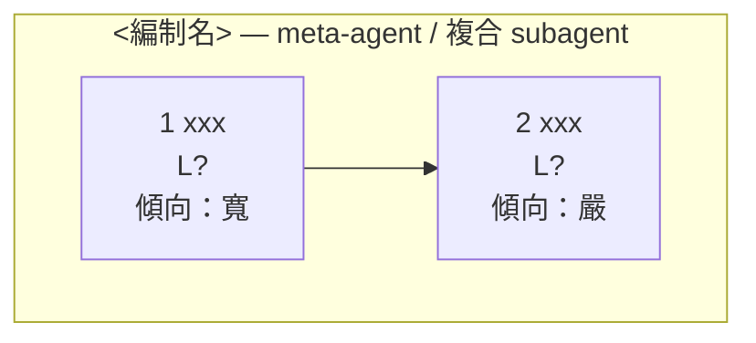

# 系統規格模板

**先畫編制圖，再展開 subagent。** 反過來做會得到一份看不懂的文件——讀的人要先知道有誰，才看得懂各自在做什麼。

編制圖上**只出現 subagent**。precheck、演算單元等五層內部零件不上圖。

---

# <system-name>

## 1. 風險判定

| | |
|---|---|
| 目標（一句話） | |
| 不可逆動作 | |
| **最壞後果** | |
| **可逆嗎** | |
| **失敗方向倒向哪邊** | |

結構深度由此決定，不由功能複雜度決定。

## 2. 編制圖



多個編制時，一個觸發源畫一個 subgraph，並標明觸發條件（日循環／事件驅動／使用者輸入／排程）。

## 3. Subagent 清單

**✕ = 塌縮。** 每個 subagent 一行。

| # | subagent | 引導層（關鍵條文） | 調度 | 邊界（grants） | 演算 | 資料 |
|---|---|---|---|---|---|---|
| 1 | | | | | L? | |

### 非 subagent 的單元

| 單元 | 為什麼不是 agent |
|---|---|
| | 沒有禁區，正確性由程式碼保證 |

### 張力對

| 寬 | 嚴 | 為什麼不能合併 |
|---|---|---|
| | | |

## 4. 憲章

版本：`v1`（創建版，此後所有 diff 對照此版）

| ID | kind | risk | 條文 | scope | hard_check |
|---|---|---|---|---|---|
| C-1 | grant | high | | boundary | |
| C-2 | forbid | high | | all | |

**檢查**：所有 high 條目都有**真的擋得住**的 hard_check。配不出來的降 low 並說明，不要掛假的。

## 5. 不可逆動作總表

| 動作 | 屬於 | reversible | idempotency_key | 數值上界 |
|---|---|---|---|---|
| | | false | | |

可逆動作用 denylist，不必列在此。

**上界是最後一道**——不依賴任何理解能力。

## 6. 拓撲

```
甲 ──→ 乙        宣告的邊
  ╳ 甲 → 丙      未宣告即不可達
```

system budget：跨邊不重置。cycle_budget：<n>

## 7. L3 → 不可逆 的路徑

| 路徑 | 中間插入的關卡 |
|---|---|
| | L2（帶 evidence[]） → hard_check |

## 8. 資料層

| key | 內容 | 壽命 | 可壓縮 |
|---|---|---|---|
| `__refusals` | 拒絕紀錄 | 永久 | **否** |
| `__amendments` | 修法紀錄 | 永久 | **否** |

介面只有 `read` / `append` / `annotate`。

## 9. 反向通道與監控

| 通道 | 觸發 | 去向 |
|---|---|---|
| 調度 → 引導 | 目標在現行約束下不可達 | `RefusalReport` |
| 邊界 → 引導 | 同一 action 攔截數 > 閾值 | 統計告警 |
| 引導 → 開發期 | 任何 `loosen` 提案 | 人類簽署 |

| 指標 | 意義 | 閾值 |
|---|---|---|
| 邊界攔截數 | 調度層失職 | > 0 即異常 |
| **拒絕率歸零** | **可能是護欄已被架空** | 紅旗 |

## 10. 未決事項

<人類決定、agent 不得代決。至少包含所有 `loosen` 提案的 `worst_case`、所有數值上界、以及哪些條文永遠不可 loosen。>
